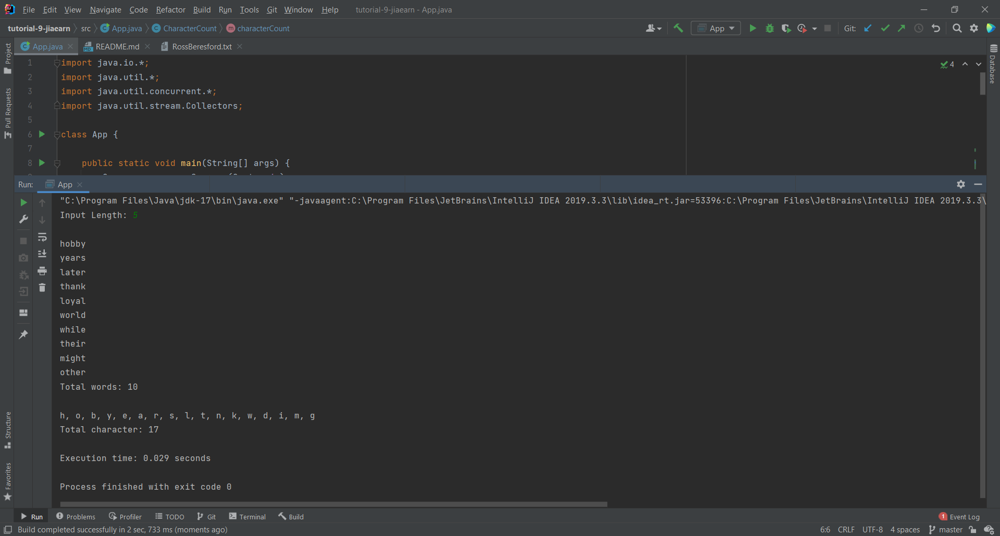

## Your Info:
1. Matric Number: 269509
2. Name: Tan Jia Earn


## Instruction:

1. Write a Java program to count the total character of identified words from the `RossBeresford.txt` below:

   https://github.com/STIW3054-A211/Template-Tutorial-7/blob/master/src/RossBeresford.txt

2. The words will be identified based on the length of words input from the keyboard.

3. Your program should implement __TWO (2)__ `CyclicBarrier` where;
   1. the 1st barrier will wait until all words have been counted and listed.
   1. the 2nd barrier will wait until all characters have been counted and listed.

4. Calculate the execution time.

5. The program file and the class name which has the main method should be named `App.java` and place in the `src` folder.

6. Screenshot the result and upload to this repo too.

7. Watch the video to clone, add, commit and push a repository to GitHub: https://youtu.be/RXV3Yusr0SI


## Expected Output (example):
```
Input Length: 5

abcde
fghij
klmno
...
...
Total words: xx

a, b, c, d, e, ....
Total characters: xxx

Execution time: 0.005 seconds
```

## Your Output/Result



